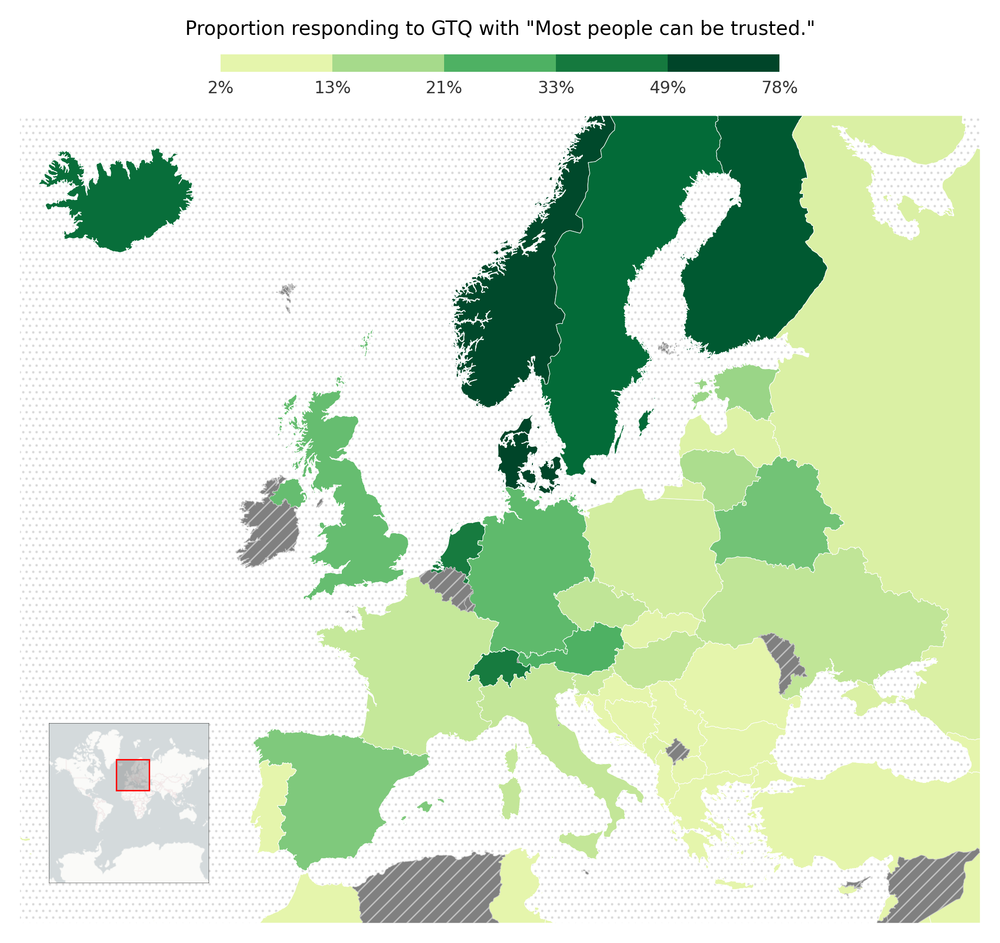
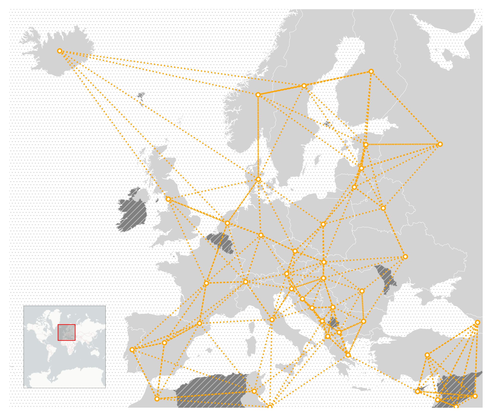
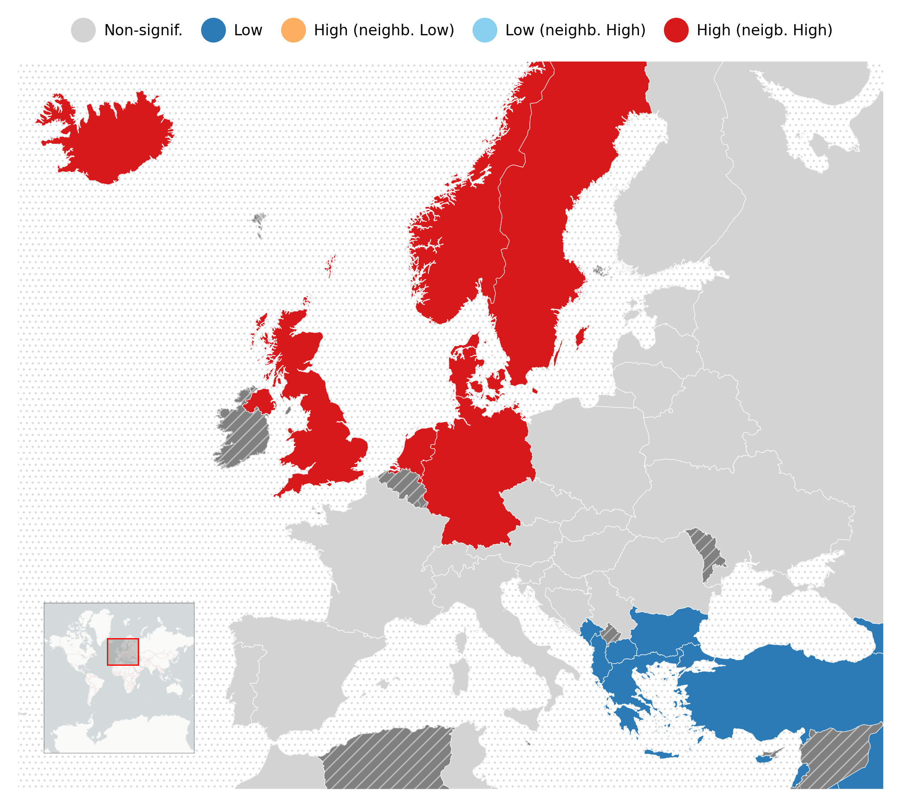

# Spatial Analytics Showcase: Geospatial Distribution of Generalized Trust in Continental Europe

<p align="middle">
  
   
  
</p>

This repository contains source code and replication instructions for the Spatial Analytics project "Geospatial Distribution of Generalized Trust in Continental Europe".

[`src/analysis.ipynb`](src/analysis.ipynb) contains the analysis workflow.

## Replication

The analysis may be replicated by installing the package dependencies and running the analysis workflow notebook with [Python 3.12.3](https://www.python.org/downloads/release/python-3123/). Data visualizations are exported to [`output/`](output/).

```console
$ python --version                      # check that Python 3.12.3 is installed
3.12.3
$ pip install -r requirements.txt       # install package dependencies
$ jupyter execute src/analysis.ipynb    # run analysis workflow notebook
```

If running from a UNIX bash command line shell, simply executing [`run.sh`](run.sh) will handle this process by setting up a Python virtual environment, installing package dependencies and running analysis workflow.

```console
$ source run.sh
[SUCCESS] setup completed
[SUCCESS] workflow completed
```

> N.B.: the full World Values Survey (WWS) dataset (`EVS_WVS_Joint_Csv_v5_0.csv`) is not tracked by this repository due to excessive file size. It can be downloaded from [worldvaluessurvey.org](https://www.worldvaluessurvey.org/WVSEVSjoint2017.jsp) and placed in `data/` before running the analysis workflow.
>
>If `data/EVS_WVS_Joint_Csv_v5_0.csv` is not present when running the analysis, the workflow defaults to loading `data/wws_dataset.csv` (a distilled version of the WWS dataset containing only the attribute data relevant to the present analysis).

## License

[CC BY-SA 4.0](https://creativecommons.org/licenses/by-sa/4.0/) (Attribution-ShareAlike 4.0 International)